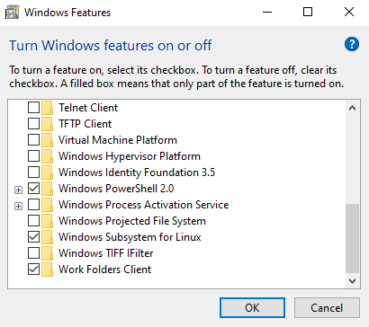
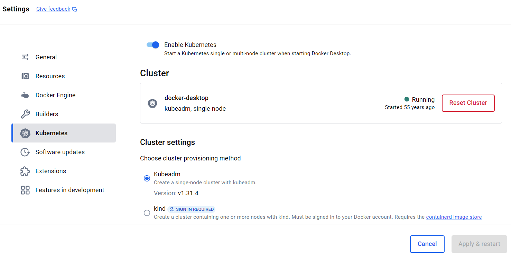

# Kubernetes on WSL (Windows Subsystem for Linux)
> [!TIP]
> This is a project shows how to build an Kubernetes Platform in a WSL environment. Of course, the same can be applied in a general Linux environment.

# Workspace
## Install Debian on WSL
Open Settings > Apps > Programs and Features > Turn Windows features on or off dialog and select the *Windows Subsystem for Linux* to enable WSL on your system. You may reboot your system.



After you have enabled WSL, you can install linux distribution via Microsoft Store. We will use the latest version of Debian linux for the hands-on lab. Open Microsoft Store app and search *Debian* (Debian 12, Bookworm), and install.

To verify your install, open windows terminal or command terminal and run `wsl -l -v` command to list WSL distributions. For more details about WSL command, please refer to [Basic commands for WSL](https://learn.microsoft.com/en-us/windows/wsl/basic-commands).

## Kubernetes
Kubernetes, is an open-source platform designed to automate the deployment, scaling, and management of containerized applications. Containers are lightweight, portable units that bundle an application with its dependencies, making them easy to move between environments. Kubernetes ensures these containers run efficiently and reliably across a cluster of machines. This setup allows you to run Kubernetes locally within WSL, providing a seamless development environment. The simplest way is to access the Kubernetes is provided by Docker Desktop.

> [!IMPORTANT]
> WSL2 (WSL Version 2) is required to enable local Kubernetes within WSL. Because WSL1 (WSL Version 1) lacks the necessary kernel features for containerization, specifically namespace and cgroup support.
>
> - WSL1 Limitations: WSL1 acts as a translation layer, mapping Linux kernel calls to the Windows kernel, but it doesn't provide a real Linux kernel. This means it lacks the features needed for containerization, such as namespaces and cgroups, which are fundamental to how containers work.
> - WSL2 Requirement: WSL2, on the other hand, runs a virtual machine with a real Linux kernel, allowing for the necessary kernel features to be present. This is why you need WSL2 to run container technologies.
> You can check your WSL version by running `wsl -l -v` in PowerShell.

### Install Docker Desktop
Download Docker Desktop from the [official website](https://www.docker.com/products/docker-desktop) and install. During installation, ensure the option to **enable WSL integration** is selected.

Once installed, you can verify installation using `wsl -l -v` command on Windows PowerShell:
```
  NAME              STATE           VERSION
* Debian            Running         2
  docker-desktop    Running         2
```

Open Docker Desktop and go to *Settings > Resources > WSL Integration* to verify if the WSL integration is enabled.

### Enable Kubernetes in Docker Desktop
In Docker Desktop, navigate to *Settings > Kubernetes* and check the box for *Enable Kubernetes* and click **Apply & Restart**. Then, wait for Docker Desktop to download the necessary Kubernetes components. The Kubernetes icon will turn green once it's ready.



To verify Kubernetes installation, open your linux terminal in WSL and run the following commands to verify Kubernetes is running:
```bash
kubectl version --client
kubectl get nodes
```
You should see at least one node listed, confirming your cluster is up and running.

## asdf
*asdf*, a multi-runtime version manager is a centralized tool that allows users to easily install and switch between different versions of development tools. The old way of working required multiple CLI (Command Line Interface) version managers, each with their distinct API, configuration files and implementations (e.g., $PATH manipulation, shims, environment variable, etc ...). However, *asdf* is providing 1/ a **single interface** and configuration file to simplify development
workflow, and can be extended to all tools and runtimes via a simple plugin interface. And it supports 2/ version definitions with one file (.tool-version), you can share with your team ensuring everyone is using the **exact same* version of tools.

### Install asdf
In this example, we will install pre-compiled *asdf* binary.

1. Visit [https://github.com/asdf-vm/asdf/releases](https://github.com/asdf-vm/asdf/releases) and download the appropriate archive for your operating system/architecture combination. This is an example to download package for Linux (x86 64-bit architecture).
```bash
curl -LO https://github.com/asdf-vm/asdf/releases/download/v0.16.6/asdf-v0.16.6-linux-amd64.tar.gz
```
2. Extract the *asdf* binary in the archive into a directory on your `$PATH` (*$HOME/.local/bin* or */usr/local/bin*).
3. Verify *asdf* is on your shell's `$PATH` by running `type -a asdf`. The directory you placed the asdf binary in should be listed on the first line of the output from type.

For more details, please refer to [the getting started guide](https://asdf-vm.com/guide/getting-started.html).

### Configure asdf
Add the following to `~/.bash_profile` (bash) or `~/.zshrc` (zsh).
```bash
export PATH="${ASDF_DATA_DIR:-$HOME/.asdf}/shims:$PATH"
```

### Install kubectl
*kubectl* is a command line tool for communicating with a Kubernetes cluster's control plane, using the Kubernetes API.Install *kubectl* and set current version.
```bash
asdf plugin add kubectl
asdf install kubectl 1.32.1
asdf set kubectl 1.32.1
asdf list                 # or kubectl version --client
```

To install the latest version, run `asdf install kubectl latest` instead of a specific version. And then, you can list all installed versions and switch to version what you want.
```bash
asdf list
asdf set kubectl 1.32.1
```

### Install helm
Helm is a package manager for Kubernetes. It uses 'charts' as its package format, which is based on YAML. Helm provides a command line tool to manage helm charts. Install *helm*.

```bash
asdf plugin add helm
asdf install helm 3.17.1
asdf set helm 3.17.1
asdf list                 # or helm version
```

# Clean up

# Additional Resources
- [asdf - The multiple runtime version manager](https://asdf-vm.com/)
